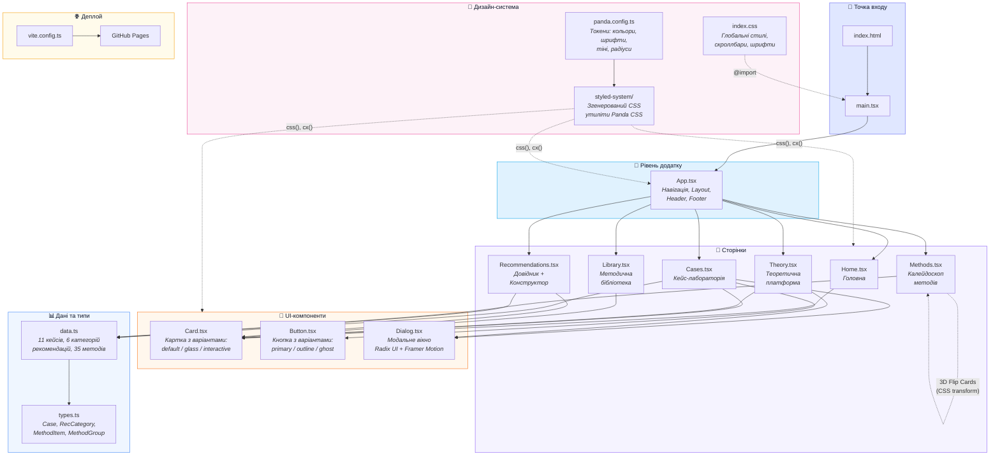

# 📚 Inclusive English — Methodology Hub

> **Методичний хаб: навчання англійської мови дітей з особливими освітніми потребами**
>
> Цифрове методичне рішення з технології навчання учнів з ООП в інклюзивних класах початкової школи

**Автор:** Дроздова Ксенія Олексіївна  
**Спеціальність:** 035.10 Філологія, «Прикладна лінгвістика»  
**Заклад освіти:** Національний університет кораблебудування імені адмірала Макарова  
**Факультет:** Філологічний факультет, кафедра прикладної лінгвістики  
**Група:** 4721  

🔗 **Демо:** [https://Khar-Ma2.github.io/drozdova-bachelor-thesis/](https://Khar-Ma2.github.io/drozdova-bachelor-thesis/)

---

## 📖 Про проєкт

Цей вебресурс є інтерактивним науково-методичним посібником, розробленим у межах бакалаврської кваліфікаційної роботи. Він створений для вчителів, асистентів учителів та студентів педагогічних спеціальностей і поєднує теоретико-правовий фундамент, практичні психолого-педагогічні профілі дітей (кейси) та інтерактивні інструменти для моделювання уроків англійської мови в інклюзивних класах.

### Функціональні розділи

| Розділ | Опис |
|---|---|
| 🏠 **Головна** | Огляд проєкту, інформація про автора, навігація по розділах |
| 📚 **Теоретична платформа** | Концептуалізація ООП, нормативно-правовий таймлайн (міжнародний та вітчизняний), календар інклюзивного амбасадора |
| 🧪 **Кейс-лабораторія** | 11 детальних психолого-педагогічних кейсів учнів з ООП та ТОП із модальними вікнами для аналізу |
| 📖 **Рекомендаційний довідник** | Методичні рекомендації для 6 категорій нозологій (РАС, ТОП, ОРА, ЗПР, РДУГ, ЗНМ) |
| 🛠️ **Діагностичний конструктор** | Інтерактивний чеклист симптомів для генерації індивідуального плану корекційної підтримки |
| 🎡 **Калейдоскоп методів** | 35 лінгводидактичних прийомів у 7 методологічних групах із 3D-флеш-картками |
| 🗄️ **Методична бібліотека** | Завантаження авторських дидактичних матеріалів (флешкартки) |

---

## 🛠️ Етапи та процес створення

### Етап 1. Дослідження та контент-підготовка

На першому етапі було сформовано науково-методичну базу проєкту: проаналізовано нормативно-правові документи, систематизовано психолого-педагогічні кейси, розроблено рекомендації для кожної категорії нозологій та підібрано 35 методів навчання. Весь контент було структуровано в типізовані моделі даних для подальшої інтеграції.

### Етап 2. Прототипування та вибір архітектури

Початкова версія посібника була реалізована як статичний HTML-файл (`test5.html`, ~180 КБ) з інлайновими стилями та JavaScript-логікою. Ця монолітна структура продемонструвала обмеження при масштабуванні та підтримці. Було прийнято рішення про міграцію на компонентну React-архітектуру.

### Етап 3. Міграція на React SPA

Проєкт було ініціалізовано через **Vite** з шаблоном React + TypeScript. Монолітний HTML було декомпозовано на:
- **6 сторінкових компонентів** (`Home`, `Theory`, `Cases`, `Library`, `Recommendations`, `Methods`)
- **3 переіспользовуваних UI-компонентів** (`Card`, `Button`, `Dialog`)
- **Шар даних** (типізовані інтерфейси в `types.ts`, дані у `data.ts`)

### Етап 4. Впровадження дизайн-системи

Для стилізації було обрано **Panda CSS** — CSS-in-JS рішення з нульовим рантайм-навантаженням. Визначено дизайн-токени:
- Кольорова палітра бренду (Indigo/Sky) та палітра нозологій (6 унікальних кольорів)
- Типографіка на базі шрифту **Plus Jakarta Sans** (Google Fonts)
- Тіні, радіуси заокруглень та адаптивні брейкпоінти

### Етап 5. Інтерактивність та UX-полірування

Додано анімації через **Framer Motion** (hover-ефекти, анімації появи, 3D-фліп-картки), модальні вікна через **Radix UI Dialog** з доступністю (a11y), sticky-навігацію, glassmorphism-ефекти та кастомні скроллбари.

### Етап 6. Деплой та публікація

Налаштовано CI/CD-пайплайн через **GitHub Pages** за допомогою пакету `gh-pages`. Збірка виконується Vite з TypeScript-валідацією, а результат розгортається на `https://Khar-Ma2.github.io/drozdova-bachelor-thesis/`.

---

## 💡 Чому React, а не конструктор сайтів?

Більшість студентів створюють методичні посібники на конструкторах типу **Google Sites**, **Tilda** чи **Wix**. Нижче — порівняння та аргументація на користь React-рішення:

### Обмеження конструкторів

| Критерій | Конструктори (Google Sites тощо) | React SPA |
|---|---|---|
| **Інтерактивність** | Обмежена вбудованими віджетами; неможливо створити діагностичний конструктор або 3D-картки | Повна свобода: будь-яка логіка, стани, анімації, умовний рендеринг |
| **Дизайн** | Шаблонний, не адаптується під специфіку проєкту | Повний контроль: дизайн-система, кольорові палітри нозологій, glassmorphism |
| **Типізація даних** | Контент вбивається вручну, дублювання, відсутність валідації | TypeScript-інтерфейси гарантують цілісність 11 кейсів × 10 полів, 35 методів |
| **Масштабованість** | Складно додати нові розділи без порушення структури | Компонентна архітектура: додати нову сторінку = створити один `.tsx` файл |
| **Продуктивність** | Сторонній рантайм, реклама, обмежена оптимізація | Статична збірка Vite, мінімальний бандл, миттєве завантаження |
| **Володіння кодом** | Код належить платформі, ризик втрати при зміні тарифу | Повне володіння кодом, хостинг на GitHub Pages безкоштовно |
| **Наукова валідність** | Не демонструє технічних компетенцій автора | Демонструє навички веброзробки, що є релевантним для спеціальності «Прикладна лінгвістика» |

### Ключові переваги React для цього проєкту

1. **Інтерактивний діагностичний конструктор** — неможливо реалізувати на конструкторі: чеклист симптомів із динамічною генерацією рекомендацій потребує керування станом (`useState`)
2. **3D-фліп-картки методів** — CSS-трансформації з `perspective`, `backface-visibility` та React-стейтом для кожної з 35 карток
3. **Модальні вікна кейсів** — доступні (a11y) діалоги через Radix UI з анімаціями Framer Motion, де контент рендериться динамічно з масиву даних
4. **Дизайн-система нозологій** — кожна з 6 категорій має унікальний кольоровий код, що програмно застосовується до бейджів, бордерів та акцентів
5. **Типобезпека** — TypeScript-інтерфейси (`Case`, `RecCategory`, `MethodItem`) гарантують, що кожен кейс містить усі необхідні поля, а помилки виявляються на етапі компіляції

---

## 🧱 Технологічний стек

### Ядро

| Технологія | Версія | Призначення |
|---|---|---|
| [React](https://react.dev/) | 19.x | UI-бібліотека для побудови компонентного інтерфейсу |
| [TypeScript](https://www.typescriptlang.org/) | 6.x | Статична типізація для надійності коду |
| [Vite](https://vite.dev/) | 8.x | Швидкий збірник із HMR (Hot Module Replacement) |

### Стилізація

| Технологія | Призначення |
|---|---|
| [Panda CSS](https://panda-css.com/) | Zero-runtime CSS-in-JS з дизайн-токенами |
| [Plus Jakarta Sans](https://fonts.google.com/specimen/Plus+Jakarta+Sans) | Основний шрифт (Google Fonts) |

### UI та анімації

| Технологія | Призначення |
|---|---|
| [Framer Motion](https://motion.dev/) | Анімації компонентів: hover, appear, 3D-flip |
| [Radix UI Dialog](https://www.radix-ui.com/) | Доступні (a11y) модальні вікна |

### Інфраструктура

| Технологія | Призначення |
|---|---|
| [GitHub Pages](https://pages.github.com/) | Хостинг статичного сайту |
| [gh-pages](https://www.npmjs.com/package/gh-pages) | Автоматизація деплою |
| [ESLint](https://eslint.org/) | Лінтинг коду |
| [PostCSS](https://postcss.org/) | Обробка CSS (інтеграція з Panda CSS) |

---

## 🏗️ Архітектура проєкту



### Пояснення архітектури

Архітектура проєкту побудована за принципом **Feature-Sliced Design** з чітким розділенням відповідальностей:

**🚀 Точка входу** — `index.html` завантажує `main.tsx`, який монтує React-додаток у DOM-елемент `#root`. Тут підключаються глобальні стилі (`index.css`) та шрифт Plus Jakarta Sans.

**📱 Рівень додатку** — `App.tsx` є кореневим компонентом, що реалізує:
- Клієнтську навігацію через `useState` (без React Router, оскільки SPA не потребує маршрутизації)
- Sticky-хедер з glassmorphism-ефектом та навігаційними таблетками
- Умовний рендеринг сторінок залежно від обраної секції
- Преміум-футер з динамічним роком

**📄 Сторінки** — кожна сторінка є ізольованим компонентом з власною логікою та стилями:
- `Home` — hero-банер, картка автора з копіюванням email, сітка можливостей
- `Theory` — таймлайн із кольоровими нодами, календар із модальними деталями
- `Cases` — адаптивна сітка з 11 карток, кожна розкривається у детальний Dialog
- `Recommendations` — два режими (довідник із сайдбаром + конструктор із чеклістом)
- `Methods` — 7 вкладок × 5 карток = 35 методів із CSS 3D-трансформаціями
- `Library` — завантаження дидактичних матеріалів

**🧩 UI-компоненти** — переіспользовувані «будівельні блоки»:
- `Card` підтримує 3 варіанти (`default`, `glass`, `interactive`) та опціональний `glowColor`
- `Button` має 5 варіантів та 3 розміри з Framer Motion анімаціями
- `Dialog` базується на Radix UI з анімованими overlay та content через Framer Motion

**📊 Дані та типи** — усі дані зосереджені в одному файлі (`data.ts`, ~108 КБ), що спрощує оновлення контенту без зміни UI-логіки. TypeScript-інтерфейси (`types.ts`) забезпечують типобезпеку.

**🎨 Дизайн-система** — `panda.config.ts` визначає дизайн-токени (кольори бренду, палітра нозологій, шрифти, тіні, радіуси), які компілюються у `styled-system/` та використовуються через функції `css()` і `cx()`.

**🌐 Деплой** — Vite збирає продакшн-бандл із base-path `/drozdova-bachelor-thesis/`, а `gh-pages` автоматично публікує вміст папки `dist/` на GitHub Pages.

---

## 🚀 Локальний запуск

```bash
# Встановлення залежностей
npm install

# Генерація Panda CSS
npm run prepare

# Запуск dev-сервера
npm run dev

# Збірка для продакшну
npm run build

# Деплой на GitHub Pages
npm run deploy
```

---

## 📁 Структура файлів

```
drozdova-bachelor-thesis/
├── index.html              # Точка входу HTML
├── vite.config.ts          # Конфігурація Vite
├── panda.config.ts         # Дизайн-токени Panda CSS
├── postcss.config.cjs      # Інтеграція PostCSS + Panda
├── package.json            # Залежності та скрипти
├── public/
│   ├── favicon.svg         # Іконка сайту
│   ├── icons.svg           # SVG-спрайт
│   └── flashcards-professions.zip  # Дидактичні матеріали
├── src/
│   ├── main.tsx            # Точка входу React
│   ├── index.css           # Глобальні стилі
│   ├── app/
│   │   └── App.tsx         # Кореневий компонент
│   ├── pages/
│   │   ├── Home.tsx        # Головна сторінка
│   │   ├── Theory.tsx      # Теоретична платформа
│   │   ├── Cases.tsx       # Кейс-лабораторія
│   │   ├── Library.tsx     # Методична бібліотека
│   │   ├── Recommendations.tsx  # Довідник + Конструктор
│   │   └── Methods.tsx     # Калейдоскоп методів
│   ├── components/
│   │   ├── Card.tsx        # Компонент картки
│   │   ├── Button.tsx      # Компонент кнопки
│   │   └── Dialog.tsx      # Модальне вікно
│   ├── features/
│   │   ├── types.ts        # TypeScript-інтерфейси
│   │   └── data.ts         # Усі дані проєкту
│   └── assets/             # Статичні ресурси
└── styled-system/          # Згенерований Panda CSS
```

---

## 📄 Ліцензія

Проєкт створено в межах роботи над бакалаврською кваліфікаційною роботою.  
© 2025–2026 Дроздова Ксенія Олексіївна
